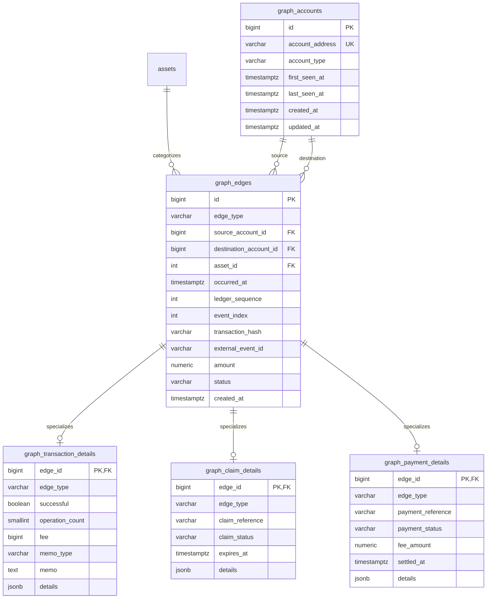

# AstroML Database Schema

## Overview

AstroML now has two complementary PostgreSQL schema layers:

1. Raw Stellar ingestion tables used by the current stream pipeline.
2. A normalized graph-mirror schema for account timelines and graph analytics.

The split is intentional. The raw layer preserves source fidelity, while the
graph mirror provides stable surrogate keys, typed edges, and reviewer-friendly
constraints for time-series retrieval.

## Raw Storage Layer

The existing raw schema remains unchanged:

| Blockchain concept | Graph meaning | Table |
|--------------------|---------------|-------|
| Ledger close       | Temporal anchor | `ledgers` |
| Transaction        | Container for operations | `transactions` |
| Operation          | Raw directed edge/event | `operations` |
| Account snapshot   | Latest observed node state | `accounts` |
| Asset registry     | Canonical asset dimension | `assets` |

These tables continue to support ingestion from Horizon and raw feature
extraction.

## Graph Mirror Layer

The new graph mirror is optimized for normalized, account-centric reads:

| Mirror concept | Purpose | Table |
|----------------|---------|-------|
| Canonical node | One row per unique account | `graph_accounts` |
| Shared edge/event | Time-series fact table for transactions, claims, and payments | `graph_edges` |
| Transaction subtype | Transaction-only attributes | `graph_transaction_details` |
| Claim subtype | Claim-only attributes | `graph_claim_details` |
| Payment subtype | Payment-only attributes | `graph_payment_details` |

`graph_edges.asset_id` reuses the existing `assets` table so asset identity is
not duplicated across the raw and mirror layers.

## Relationship Diagram



## Table-by-Table Notes

### `graph_accounts`

Canonical node table for the mirror.

- `id` is a surrogate key for compact foreign keys and stable joins.
- `account_address` is the natural key and is unique.
- `first_seen_at` and `last_seen_at` track observation windows for the account
  inside the mirror, not on-chain account creation semantics.
- `account_type` is optional because some upstream sources may classify
  accounts while others may not.

### `graph_edges`

Shared event table for graph traversal and timeline queries.

- `edge_type` is constrained to `transaction`, `claim`, or `payment`.
- `source_account_id` is required; `destination_account_id` is nullable only to
  support edge types where the counterparty is not yet known or not applicable.
- `occurred_at` is the business time for ordering and time-window filtering.
- `created_at` is ingestion time for operational observability.
- `external_event_id` is unique per `edge_type` and is the intended
  idempotency/upsert key.
- `ledger_sequence` and `event_index` provide deterministic tie-breaking for
  sources that expose ledger order.

### Detail Tables

The mirror keeps the shared edge table narrow and pushes subtype attributes into
1:1 detail tables.

- `graph_transaction_details` stores fields such as `fee`, `memo`, and
  `successful`.
- `graph_claim_details` stores claim lifecycle fields such as
  `claim_reference`, `claim_status`, and `expires_at`.
- `graph_payment_details` stores payment lifecycle fields such as
  `payment_reference`, `payment_status`, `fee_amount`, and `settled_at`.
- Each detail table has a composite foreign key to `(graph_edges.id,
  graph_edges.edge_type)` plus a check constraint on its fixed subtype. This
  prevents a payment detail row from attaching to a claim or transaction edge.

The optional `details` JSONB column in each subtype table is reserved for
source-specific attributes that do not justify new columns yet.

## Indexing Strategy

The graph mirror is tuned for the expected read paths:

- `ix_graph_edges_occurred_at`
  Supports global time-range scans.
- `ix_graph_edges_source_occurred_at`
  Supports outbound activity for one account ordered by time.
- `ix_graph_edges_destination_occurred_at`
  Supports inbound activity for one account over a time window.
- `ix_graph_edges_type_occurred_at`
  Supports per-type timelines for `transaction`, `claim`, or `payment`.
- `ix_graph_edges_asset_occurred_at`
  Supports asset-filtered timelines and rollups.
- `ix_graph_edges_status_occurred_at`
  Supports state-aware filtering in a time window.
- `ix_graph_edges_tx_hash`
  Supports reverse lookup from a known transaction hash.
- `ix_graph_edges_ledger_event`
  Supports deterministic replay and incremental ingestion windows.
- `ix_graph_accounts_last_seen_at`
  Supports recency-oriented node lookups.

PostgreSQL btree indexes can be scanned in reverse order, so the composite
indexes remain effective for `ORDER BY occurred_at DESC` queries without making
the migration noisier.

## Query Paths Supported

This design is meant to support queries such as:

- all activity for one account ordered by `occurred_at`
- inbound or outbound edges over a time window
- all claims, payments, or transactions in a time range
- latest activity for a specific account
- filtering by `asset_id`, `edge_type`, or `status` within a window
- incremental ingestion keyed by `(edge_type, external_event_id)` and replay
  ordered by `(ledger_sequence, event_index)`

## Normalization Rationale

- Account identity is stored once in `graph_accounts`.
- Shared edge attributes live once in `graph_edges`.
- Type-specific attributes are isolated in dedicated detail tables instead of a
  single sparse table with many nullable columns.
- Asset identity is reused from the existing `assets` dimension.

This keeps the schema normalized while still practical for operational reads.

## Ingestion and Idempotency Notes

- Use `external_event_id` together with `edge_type` as the upsert key.
- When the source does not expose a single immutable event ID, the ingestion
  layer should derive one deterministically, for example from transaction hash
  plus operation or event order.
- `occurred_at` and `created_at` are intentionally separate and should not be
  conflated in application code.
- `destination_account_id` should remain null only when the source truly lacks a
  destination relationship.

## Assumptions

- The project remains Stellar-oriented, so account identifiers use the existing
  56-character account-address convention.
- `assets` remains the canonical asset dimension for both raw and mirror data.
- Claim and payment sources may vary, so subtype tables expose a few strongly
  typed lifecycle columns plus a JSONB extension field for source-specific data.

## Future Recommendations

- Add monthly or quarterly partitioning on `graph_edges.occurred_at` once row
  counts justify it.
- Consider materialized daily rollups for high-volume account analytics.
- If ingestion begins mirroring directly from the raw `operations` table, add a
  dedicated lineage column or foreign key back to the raw record that produced
  each graph edge.

## Running Migrations

```bash
alembic upgrade head
alembic downgrade base
```
